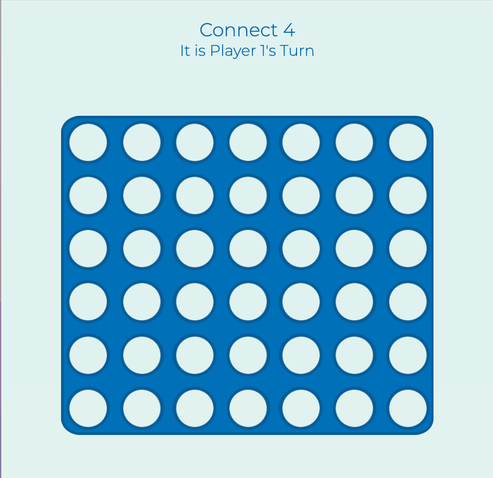

# Connect-4-Naveen-Bhatti
## Description
This project creates a connect-4 game that allows for two-players to play. The game uses an array of solutions to compare user placements of their pieces to compute the winner of the game. The game has conditions for each players win as well as a tie.
### Background
This project was made within the Software Engineering Immersive program at General Assembly with the goal to create a browser-based game to showcase the skills learned throughout the first unit.
## Getting Started
The game can be played [here](https://connect4naveen.netlify.app). The game is played similarly to Connect-4 in real life, but there is a slight change.
1. Selecting a piece/slot will cause a piece to drop to the lowest place in the column.
2. Once you "connect 4", you will be presented with a win message and an option to reset using the button below the board.
## Screenshots

#### Empty Game Board

#### Game Winning Board

## Technologies Used
Within this project, I used HTML, CSS, and Javascript. Below are basic summaries of how each technology was used:
- HTML: HTML was used to create the basic elements on the page such as the tiles, headings, and game board.
- CSS: CSS was used to create the styling and animations of the game elements such as the backgrounds, heading styling, and grid/flexbox.
- Javascript: Javascript was used to script the various functions for the actual game play as well as setting some of the styling elements dynamically.

## Future Enhancements
